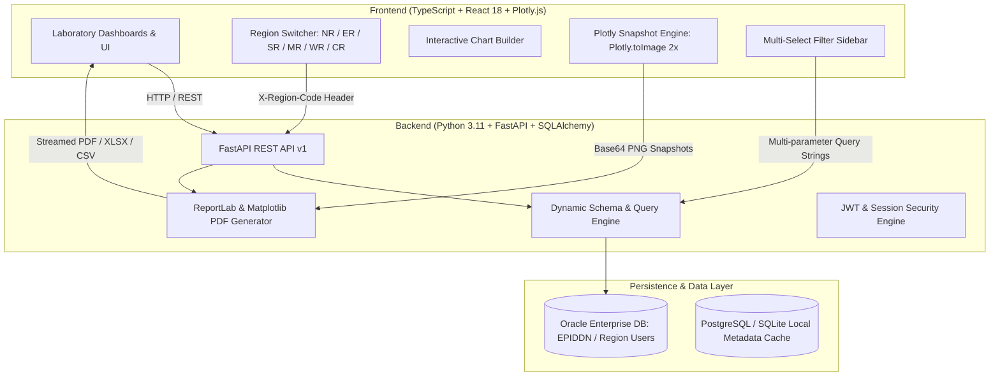

# GVMS (Graphical Visualization Management System)
## Complete Codebase Architecture & Technical Directory Map

---

### Executive Summary
The **Graphical Visualization Management System (GVMS)** is an enterprise-grade geoscience and laboratory analytics platform engineered for the **Oil and Natural Gas Corporation (ONGC)**. The system ingests, visualizes, correlates, and generates formal technical reports for geochemical, petroleum, isotopic, biomarker, and inorganic water analysis data across six major exploration regions (**NR**, **ER**, **SR**, **MR**, **WR**, **CR**).

---

## 1. System Architecture Overview



---

## 2. Technology Stack by Language

| Layer | Language / Framework | Primary Purpose | Key Libraries & Tooling |
| :--- | :--- | :--- | :--- |
| **Frontend** | **TypeScript / JavaScript** | Interactive UI, dynamic plotting, client data modeling | React 18, Vite, Plotly.js (`react-plotly.js`), TanStack Query, TailwindCSS, Lucide Icons, Axios |
| **Backend** | **Python 3.11** | REST API, database access, query synthesis, report engine | FastAPI, SQLAlchemy 2.0, Uvicorn, ReportLab, Matplotlib, Pandas, NumPy, SciPy |
| **Database** | **PL/SQL / Oracle SQL** | Primary enterprise geoscience warehouse | `oracledb` (Thin & Thick mode), Oracle 11g/12c/19c compatibility |
| **DevOps & Infra** | **YAML / Shell / Batch** | Container orchestration, process management, deployment | Docker Compose, PM2 (`ecosystem.config.cjs`), Nginx, PowerShell, Windows CMD `.bat` |

---

## 3. Directory & File Reference Index

### 3.1 Root Directory

| Path | Language / Type | Description & Purpose |
| :--- | :--- | :--- |
| [`.env`](file:///e:/GVMS%28Graphical%20Visualization%20Management%20System%29/.env) | Configuration | Active environment variables (Database credentials, ports, region configs, secret keys). |
| [`docker-compose.yml`](file:///e:/GVMS%28Graphical%20Visualization%20Management%20System%29/docker-compose.yml) | Docker YAML | Multi-container development orchestration (FastAPI, React frontend, Nginx proxy). |
| [`ecosystem.config.cjs`](file:///e:/GVMS%28Graphical%20Visualization%20Management%20System%29/ecosystem.config.cjs) | JavaScript (Node.js) | Production PM2 process configuration for background service management. |
| [`start_backend.bat`](file:///e:/GVMS%28Graphical%20Visualization%20Management%20System%29/start_backend.bat) / [`.ps1`](file:///e:/GVMS%28Graphical%20Visualization%20Management%20System%29/start_backend.ps1) | Batch / PowerShell | Automated launcher for the Python virtual environment and FastAPI Uvicorn server. |
| [`start_frontend.bat`](file:///e:/GVMS%28Graphical%20Visualization%20Management%20System%29/start_frontend.bat) / [`.ps1`](file:///e:/GVMS%28Graphical%20Visualization%20Management%20System%29/start_frontend.ps1) | Batch / PowerShell | Automated launcher for the Vite preview / development frontend server. |
| [`README.md`](file:///e:/GVMS%28Graphical%20Visualization%20Management%20System%29/README.md) | Markdown | Project onboarding, architecture summary, and quickstart guide. |
| [`requirements.md`](file:///e:/GVMS%28Graphical%20Visualization%20Management%20System%29/requirements.md) | Markdown | System prerequisites, dependencies, and environment setup guidelines. |

---

### 3.2 Backend Subsystem (`backend/`)

#### Directory Map: `backend/app/`
```
backend/app/
├── api/
│   └── v1/
│       ├── api.py                    # Root router registering all v1 endpoints
│       └── endpoints/
│           ├── auth.py               # Authentication, token exchange, and user sessions
│           ├── dashboard.py          # Lab data retrieval, stats, and dynamic data queries
│           ├── dynamic.py            # Dynamic schema exploration & custom dataset endpoints
│           ├── health.py             # Server & database connection health probes
│           ├── oracle.py             # Oracle region connection switcher & test APIs
│           ├── reports.py            # PDF / Excel / CSV report generation & snapshot export
│           └── users.py              # User management & role-based access control (RBAC)
├── core/
│   ├── config.py                     # Pydantic Settings reading environment variables
│   ├── database.py                   # SQLAlchemy engine, session factory & fast-fail pool
│   └── security.py                   # Password hashing, JWT token creation & verification
├── crud/                             # Database CRUD operation wrappers
├── db/                               # Database migrations, seed data, and schema definitions
├── labs/                             # Lab-specific computational modules & schemas
│   ├── biomarker/                    # Hopane, Sterane, Aromatic, Tricyclic schemas & math
│   ├── igc/                          # Source rock geochemistry & Rock-Eval models
│   ├── isotope/                      # Stable isotope & gas composition definitions
│   ├── oil/                          # Oil assay, API gravity, distillation calculations
│   └── surface/                      # Surface geochemistry & soil gas analysis
├── models/                           # SQLAlchemy ORM model declarations
├── schemas/                          # Pydantic request/response validation schemas
├── services/
│   ├── backup_service.py             # Database snapshot and backup automation
│   ├── csv_processor.py              # Geoscience CSV parsing, type coercion & ingestion
│   ├── formula_engine.py             # Geochemical ratio calculation & standard formulas
│   ├── geochemistry_engine.py        # Rock-Eval S1/S2/S3, TOC, HI, OI, and Tmax equations
│   ├── metabase_service.py           # Integration helpers for Metabase embedded analytics
│   └── report_generator.py           # ReportLab PDF building & Matplotlib chart generator
└── main.py                           # Application factory, CORS middleware, lifespan events
```

---

### 3.3 Frontend Subsystem (`frontend/`)

#### Directory Map: `frontend/src/`
```
frontend/src/
├── App.tsx                           # Root React application, routing & layout shell
├── main.tsx                          # Vite React DOM entry point with QueryClientProvider
├── index.css                         # Global CSS & Tailwind styling rules
├── components/
│   ├── charts/
│   │   ├── InteractiveChartBuilder.tsx # Dynamic X-Y axis chart builder with custom grouping
│   │   └── PlotlyWrapper.tsx         # Unified wrapper for responsive Plotly figures
│   ├── common/
│   │   ├── Button.tsx                # Reusable styled button component
│   │   ├── Card.tsx                  # Standard glassmorphism/card container
│   │   ├── FilterSidebar.tsx         # Universal multi-select sidebar with search & chips
│   │   ├── RegionSwitcher.tsx        # 6-region quick selector (NR, ER, SR, MR, WR, CR)
│   │   └── Spinner.tsx               # Loading spinner indicator
│   └── layout/
│       ├── Header.tsx                # Top navigation bar, region badge & user profile
│       ├── Layout.tsx                # Master page layout containing Header and Sidebar
│       └── Sidebar.tsx               # Main application navigation menu
├── context/
│   ├── AuthContext.tsx               # User authentication state & login/logout methods
│   └── RegionContext.tsx             # Active Oracle region state provider (NR, ER, etc.)
├── pages/                            # Full-page laboratory dashboards (see Section 4)
│   ├── AromaticDashboard.tsx         # Aromatic biomarker maturity & depositional plots
│   ├── Dashboard.tsx                 # Master overview and analytics dashboard
│   ├── DynamicDashboard.tsx          # Dynamic SQL table explorer and custom visualization
│   ├── GasChromatographyDashboard.tsx# Gas chromatography C1-C5, n-alkanes & chromatograms
│   ├── GasIsotopeDashboard.tsx       # Bernard, Sofer, Whiticar, CSIA & gas isotopes
│   ├── HopaneDashboard.tsx           # Hopane biomarker crossplots & maturity depth plots
│   ├── InorganicDashboard.tsx        # Water analysis, Stiff/Piper diagrams & inorganic data
│   ├── MetabaseView.tsx              # Embedded Metabase BI dashboard frame
│   ├── OilCompositionDashboard.tsx   # Crude oil assay, SARA fractions & distillation data
│   ├── OilCrossPlotDashboard.tsx     # Oil biomarker crossplots & interactive chart builder
│   ├── PrPhDashboard.tsx             # Pristane/Phytane ratios & redox environment plots
│   ├── Reports.tsx                   # Centralized technical report exporter
│   ├── Settings.tsx                  # System configuration, region settings & preferences
│   ├── SteraneDashboard.tsx          # Sterane ternary plots, C29 maturity & isomer ratios
│   ├── SurfaceDashboard.tsx          # Surface geochemistry & soil adsorbed hydrocarbon maps
│   ├── TricyclicDashboard.tsx        # Tricyclic/Tetracyclic terpane ratios & depth curves
│   └── Users.tsx                     # User management & permission administration
├── services/
│   ├── api.ts                        # Axios client instance with auth & region interceptors
│   ├── dashboard.service.ts          # API methods for fetching lab stats, charts, and tables
│   ├── dynamic.service.ts            # API methods for dynamic queries and schema catalogs
│   └── reports.service.ts            # API methods for PDF/Excel export & snapshot transport
├── types/                            # TypeScript interfaces & data type definitions
└── utils/
    ├── colors.ts                     # ONGC geoscience color palettes & styling constants
    └── plotlySnapshot.ts             # Direct high-res client Plotly snapshot capture engine
```

---

## 4. Where Does It Happen? (Cross-Reference Guide)

### 4.1 Oracle Multi-Region User Switching (`NR`, `ER`, `SR`, `MR`, `WR`, `CR`)
* **Concept**: In ONGC EPIDDN service, each exploration region corresponds to a distinct database schema user with identical host/port.
* **Frontend UI**: [`frontend/src/components/common/RegionSwitcher.tsx`](file:///e:/GVMS%28Graphical%20Visualization%20Management%20System%29/frontend/src/components/common/RegionSwitcher.tsx) renders the simplified 6-region selector.
* **Frontend State**: [`frontend/src/context/RegionContext.tsx`](file:///e:/GVMS%28Graphical%20Visualization%20Management%20System%29/frontend/src/context/RegionContext.tsx) persists the chosen region in `localStorage`.
* **Frontend Request Interceptor**: [`frontend/src/services/api.ts`](file:///e:/GVMS%28Graphical%20Visualization%20Management%20System%29/frontend/src/services/api.ts) automatically attaches `X-Region-Code` header to every outgoing HTTP call.
* **Backend Region Switcher**: [`backend/app/api/v1/endpoints/oracle.py`](file:///e:/GVMS%28Graphical%20Visualization%20Management%20System%29/backend/app/api/v1/endpoints/oracle.py) & [`backend/app/core/database.py`](file:///e:/GVMS%28Graphical%20Visualization%20Management%20System%29/backend/app/core/database.py) resolve the region code to the appropriate Oracle user credentials (`PRJDDN`, `PRJER`, `PRJSR`, `PRJMR`, `PRJWR`, `PRJCR`).

---

### 4.2 Offline Fast-Fail Startup Resilience
* **Concept**: When developing or operating offline without direct Oracle VPN connectivity, the backend must start instantaneously without blocking for minutes on TCP timeouts.
* **Implementation**: In [`backend/app/core/database.py`](file:///e:/GVMS%28Graphical%20Visualization%20Management%20System%29/backend/app/core/database.py):
  - `tcp_connect_timeout` is set to 3 seconds.
  - `retry_count` is set to 0.
  - Application startup in [`backend/app/main.py`](file:///e:/GVMS%28Graphical%20Visualization%20Management%20System%29/backend/app/main.py) catches `OperationalError` gracefully and continues serving cached metadata and client builders.

---

### 4.3 Multi-Select Filter Engine
* **Concept**: Filters for Wells, Formations, and Sample Types must allow multi-selection (e.g. `well_name=B-157N-10,BH-93,BS-19`) without throwing SQL syntax errors.
* **Frontend Component**: [`frontend/src/components/common/FilterSidebar.tsx`](file:///e:/GVMS%28Graphical%20Visualization%20Management%20System%29/frontend/src/components/common/FilterSidebar.tsx) renders searchable multi-select checkboxes with "Select All", "Clear", and active selection badges.
* **Backend Query Builder**: [`backend/app/api/v1/endpoints/reports.py`](file:///e:/GVMS%28Graphical%20Visualization%20Management%20System%29/backend/app/api/v1/endpoints/reports.py) & [`backend/app/api/v1/endpoints/dashboard.py`](file:///e:/GVMS%28Graphical%20Visualization%20Management%20System%29/backend/app/api/v1/endpoints/dashboard.py) dynamically split comma-separated values into SQL `IN (...)` parameters.

---

### 4.4 Direct Plotly Graph Snapshot & PDF Report Generation
* **Concept**: Reports can directly capture whatever the geoscientist sees on their screen (including custom zoom, selections, and interactive builder figures) and embed them into high-definition technical PDFs.
* **Client Capture**: [`frontend/src/utils/plotlySnapshot.ts`](file:///e:/GVMS%28Graphical%20Visualization%20Management%20System%29/frontend/src/utils/plotlySnapshot.ts) uses `Plotly.toImage(el, { format: 'png', width: 1200, height: 750, scale: 2 })` to generate crisp 2x resolution base64 images.
* **Client Transport**: [`frontend/src/services/reports.service.ts`](file:///e:/GVMS%28Graphical%20Visualization%20Management%20System%29/frontend/src/services/reports.service.ts) bundles snapshots and posts to `/api/v1/reports/export-pdf`.
* **Backend PDF Embedding**: [`backend/app/services/report_generator.py`](file:///e:/GVMS%28Graphical%20Visualization%20Management%20System%29/backend/app/services/report_generator.py) receives base64 payloads, decodes them via `BytesIO(base64.b64decode(...))`, and places them as Flowables into ReportLab alongside metadata and sample tables.
* **Backend Matplotlib Fallback**: If called headlessly or without snapshots, `report_generator.py` features 20+ specialized Matplotlib scientific plots matching geoscience standards (Bernard, Sofer, Whiticar, Van Krevelen, Oleanane/Bicadinane, etc.).

---

### 4.5 Laboratory Dashboards & Scientific Modules

| Laboratory / Domain | Frontend Dashboard File | Key Scientific Plots & Features |
| :--- | :--- | :--- |
| **Oil Biomarker Crossplots** | [`OilCrossPlotDashboard.tsx`](file:///e:/GVMS%28Graphical%20Visualization%20Management%20System%29/frontend/src/pages/OilCrossPlotDashboard.tsx) | Oleanane vs Bicadinane, Diahopane vs BNH, C29Ts vs Oleanane, BNH vs BNL, Interactive Chart Builder |
| **Crude Oil Composition** | [`OilCompositionDashboard.tsx`](file:///e:/GVMS%28Graphical%20Visualization%20Management%20System%29/frontend/src/pages/OilCompositionDashboard.tsx) | API Gravity vs Depth, SARA Fractions (Saturates, Aromatics, Resins, Asphaltenes), Distillation Ratios |
| **Hopane Biomarkers** | [`HopaneDashboard.tsx`](file:///e:/GVMS%28Graphical%20Visualization%20Management%20System%29/frontend/src/pages/HopaneDashboard.tsx) | Ts/(Ts+Tm), C29Ts/(C29Ts+C29H), C31 Homohopane 22S/(22S+22R) maturity curves vs depth |
| **Sterane Biomarkers** | [`SteraneDashboard.tsx`](file:///e:/GVMS%28Graphical%20Visualization%20Management%20System%29/frontend/src/pages/SteraneDashboard.tsx) | C29 20S/(20S+20R) vs ββ/(αα+ββ) maturity crossplots, C27-C28-C29 ternary facies diagrams |
| **Aromatic Biomarkers** | [`AromaticDashboard.tsx`](file:///e:/GVMS%28Graphical%20Visualization%20Management%20System%29/frontend/src/pages/AromaticDashboard.tsx) | Methylphenanthrene Index (MPI-1), Calculated %VRo, DBT/PHE vs Pr/Ph source facies crossplot |
| **Tricyclic Terpanes** | [`TricyclicDashboard.tsx`](file:///e:/GVMS%28Graphical%20Visualization%20Management%20System%29/frontend/src/pages/TricyclicDashboard.tsx) | C23/C21 vs C24/C23 TT ratios, Extended Tricyclic Ratio (ETR), TT/TeT ratio distribution |
| **Pristane / Phytane** | [`PrPhDashboard.tsx`](file:///e:/GVMS%28Graphical%20Visualization%20Management%20System%29/frontend/src/pages/PrPhDashboard.tsx) | Pr/nC17 vs Ph/nC18 depositional environment plot, Pr/Ph ratio subsurface depth profiles |
| **Gas & Stable Isotopes** | [`GasIsotopeDashboard.tsx`](file:///e:/GVMS%28Graphical%20Visualization%20Management%20System%29/frontend/src/pages/GasIsotopeDashboard.tsx) | Bernard Gas Genetic Diagram, Sofer Isotope Plot, Whiticar Gas Plot, CSIA δ13C Profile |
| **Gas Chromatography** | [`GasChromatographyDashboard.tsx`](file:///e:/GVMS%28Graphical%20Visualization%20Management%20System%29/frontend/src/pages/GasChromatographyDashboard.tsx) | C1-C5 Gas hydrocarbon fractions, Carbon number distribution bar charts, Chromatogram profiles |
| **Surface Geochemistry** | [`SurfaceDashboard.tsx`](file:///e:/GVMS%28Graphical%20Visualization%20Management%20System%29/frontend/src/pages/SurfaceDashboard.tsx) | Micro-seepage concentrations (C1, C2, C3, iC4, nC4), MBER anomaly maps, Depth profiles |
| **Inorganic Water Analysis**| [`InorganicDashboard.tsx`](file:///e:/GVMS%28Graphical%20Visualization%20Management%20System%29/frontend/src/pages/InorganicDashboard.tsx) | Formation water salinity (TDS), Major ion concentrations (Na+, K+, Ca2+, Mg2+, Cl-, SO42-, HCO3-) |

---

### 4.6 Interactive Chart Builder
* **Concept**: Allows geoscientists to choose any X column, any Y column, select color grouping, filter by depth or well, toggle log scales, and fit linear trendlines dynamically on live database records.
* **Component**: [`frontend/src/components/charts/InteractiveChartBuilder.tsx`](file:///e:/GVMS%28Graphical%20Visualization%20Management%20System%29/frontend/src/components/charts/InteractiveChartBuilder.tsx).
* **Embedded In**: Tabs inside `OilCrossPlotDashboard.tsx`, `OilCompositionDashboard.tsx`, `HopaneDashboard.tsx`, `SteraneDashboard.tsx`, etc.

---

## 5. Deployment & Runtime Workflows

### 5.1 Development Mode
```powershell
# Terminal 1: Backend
cd backend
.\venv\Scripts\Activate.ps1
python -m uvicorn app.main:app --host 127.0.0.1 --port 8000 --reload

# Terminal 2: Frontend
cd frontend
npm run dev
```

### 5.2 Production Mode (PM2 or Docker)
```powershell
# PM2 Production Startup
pm2 start ecosystem.config.cjs

# Or Docker Compose
docker-compose up -d --build
```

---

## 6. Maintenance & Extension Rules for Developers

1. **Adding a New Laboratory Dashboard**:
   - Create the page in `frontend/src/pages/<NewLab>Dashboard.tsx`.
   - Register route in `frontend/src/App.tsx`.
   - Add navigation item in `frontend/src/components/layout/Sidebar.tsx`.
   - Implement backend schema in `backend/app/labs/<new_lab>/` and register in `backend/app/api/v1/endpoints/dashboard.py`.
   - Add Matplotlib chart generator function in `backend/app/services/report_generator.py`.

2. **Styling & Design Guidelines**:
   - Maintain the ONGC enterprise aesthetic with clean typography (Inter / Outfit), crisp contrast, and standard geoscience color codes.
   - For all charts, leverage `applyGlobalLayoutDefaults()` from `frontend/src/components/charts/PlotlyWrapper.tsx` for consistent black axes, zero lines, and legend positioning.

3. **Plotly Snapshots in Reports**:
   - Every dashboard export button should invoke `reportsService.downloadReportWithSnapshots(datasetId, serializedFilters)`. This automatically extracts all on-screen `.js-plotly-plot` canvases and passes them to the PDF report pipeline.

---
*Created for ONGC Geochemistry & Laboratory Visualization Systems.*
