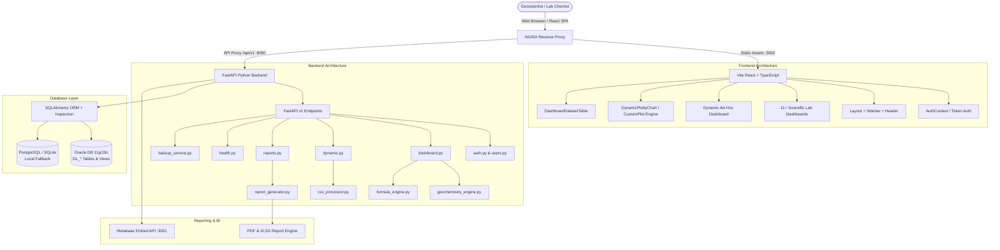

# GVMS (Graphical Visualization Management System) — Comprehensive Architecture & Codebase Guide

---

## 1. Executive Overview

The **Graphical Visualization Management System (GVMS)** is an enterprise-grade Laboratory Information Management System (LIMS) and scientific geochemistry visualization platform engineered for oil and gas exploration workflows at **ONGC (Oil and Natural Gas Corporation)**.

### Core Objectives
1. **Multi-Lab Ingestion & Registry**: Automated parsing, schema matching, normalization, and versioned ingestion of analytical laboratory data across Source Rock, Gas Chromatography (IGC), Gas Stable Isotopes, Biomarkers, Oil Composition, and Surface Geochemistry.
2. **Interactive Scientific Crossplots**: Real-time geochemical interpretation graphs (e.g., $S_2 \text{ vs } TOC$, $HI \text{ vs } T_{\max}$, Modified Van Krevelen, Pristane/Phytane maturity crossplots, Sterane/Hopane ternary diagrams, Isotope $\delta^{13}C$ Whiticar/Chung plots, CSIA profiles).
3. **Dynamic Interactive Custom Chart Builder**: An ad-hoc free-form charting engine that empowers geoscientists to dynamically pair any registered numeric/categorical variables into 2D/3D scatter plots, depth profile logs, histograms, box plots, violin plots, and correlation heatmaps.
4. **Unified Top Collapsible Dataset Records View**: Instant, searchable, and exportable raw data inspection at the top of every scientific dashboard, collapsed by default to maximize screen real estate.
5. **Oracle 11g/19c & PostgreSQL Integration**: Full compatibility with legacy enterprise Oracle databases (direct table schemas and `_VW` views) with automated fallback to PostgreSQL or SQLite.
6. **Enterprise Security & Compliance**: Role-Based Access Control (RBAC: Super Admin, Lab Admin, Geochemist, Viewer), JWT session security, optional Active Directory / LDAP authentication, and comprehensive audit trail logging.

---

## 2. High-Level System Architecture



---

## 3. End-to-End Workflow & Core Subsystems

### 3.1 Data Ingestion & Schema Alignment Pipeline
1. **File Upload**: Users upload CSV or XLSX datasets via the Dynamic Dashboard or Lab Registry.
2. **Schema Detection (`csv_processor.py`)**:
   - The engine scans header rows, normalizes string casing and punctuation, and detects aliases/synonyms against the `VariableRegistry`.
   - Distinguishes numeric metrics from categorical metadata (Well Name, Formation, Sample Type, Depth).
   - Dynamically calculates derived indices (e.g., $HI = (S_2 / TOC) \times 100$, $OI = (S_3 / TOC) \times 100$, $PI = S_1 / (S_1 + S_2)$).
3. **Database Insertion**:
   - For dedicated Oracle tables (e.g., `DL_ISOTOPE_CSIA_`, `DL_BIOMARKER_STERANE_`), records are mapped to strict Oracle types (`NUMBER(20,2)`, `VARCHAR2`, `DATE`, sequences).
   - For ad-hoc user datasets, records are stored in `generic_dataset_records` as structured JSON with indexed key fields.

### 3.2 Dynamic Geochemistry & Visualization Engine
- **Plot Generation**: Endpoints `/dashboard/scientific-plots` and `/dashboard/chart-data` query the active dataset, apply user filters (Well, Depth Range, Formation, Sample Type), and structure coordinates for Plotly.js.
- **Custom Chart Builder**:
  - Located in Section 2 of the main dashboard and inside each specialized lab view.
  - Allows geoscientists to select $X$, $Y$, $Z$, and Color/Series variables on the fly.
  - Supports 16+ visualization types including Scatter, Line, Bar, Depth Profiles (inverted Y-axis for subsurface depth), Boxplots, Violin plots, Treemaps, Sunbursts, 3D Scatters, and Pearson Correlation Matrix Heatmaps.
  - **Collapsible Design**: Initialized in collapsed state (`false`) to keep initial view clean; issues network requests only upon expansion.

### 3.3 Unified Top Collapsible Dataset Records View
- Rendered via `<DashboardDatasetTable />` at the top of every dashboard.
- Default collapsed (`showTable: false`) to avoid cluttering crossplots.
- Offers instant column search, pagination, sortable headers, and one-click CSV export of the active filtered dataset.

### 3.4 Automated Reporting Engine (`report_generator.py`)
- Generates high-resolution PDF interpretation dossiers and XLSX workbooks.
- Embeds statistical KPI tables, distribution summaries, sample categorization charts, and geochemical maturity classifications.

---

## 4. Complete Repository File Structure & Detailed Inventory

```
GVMS(Graphical Visualization Management System)/
├── .env.example                     # Environment template configuration
├── .gitignore                       # Git ignore definitions
├── docker-compose.yml               # Local container orchestration (App + DB + Metabase)
├── docker-compose.prod.yml          # Production multi-container deployment configuration
├── install_backend_offline.bat      # Air-gapped offline pip install script
├── start_backend.bat                # Windows backend launch script
├── start_frontend.bat               # Windows frontend launch script
├── requirements.md                  # Project software and dependency specs
├── setup.md                         # Detailed environment configuration guide
├── info.md                          # Geochemical domain specifications
├── progress.md                      # Development milestones and change log
│
├── backend/                         # FastAPI Python Backend Application
│   ├── Dockerfile                   # Backend Docker build instructions
│   ├── pyproject.toml               # Python project configuration
│   ├── requirements.txt             # Python PIP dependency list
│   └── app/
│       ├── main.py                  # FastAPI entry point, CORS, and router registration
│       ├── api/                     # REST API Routing
│       │   └── v1/
│       │       ├── api.py           # API Router aggregation
│       │       └── endpoints/
│       │           ├── auth.py      # Login, JWT issuance, password reset, token validation
│       │           ├── dashboard.py # Scientific plots, KPIs, chart data, correlation matrices
│       │           ├── dynamic.py   # Dynamic table/view registry, CSV ingest, custom schemas
│       │           ├── health.py    # Health check, DB connectivity probe, diagnostics
│       │           ├── reports.py   # PDF & Excel report dispatch endpoints
│       │           └── users.py     # User management & RBAC admin endpoints
│       ├── core/                    # Core Config & Infrastructure
│       │   ├── config.py            # Pydantic Settings (DB URLs, JWT keys, CORS, Oracle)
│       │   ├── database.py          # Session factory & Engine configuration
│       │   ├── graph_config.py      # Predefined scientific chart metadata & formula mappings
│       │   ├── logging.py           # Enterprise structured logging setup
│       │   └── security.py          # Password hashing (bcrypt) & JWT token handlers
│       ├── crud/                    # Database CRUD Repositories
│       │   ├── crud_log.py          # Audit log repository
│       │   ├── crud_registry.py     # Dataset & Variable registry CRUD
│       │   ├── crud_sample.py       # Geochemical sample queries & filtering
│       │   └── crud_user.py         # User account CRUD & role management
│       ├── db/                      # Database Initialization & Session
│       │   ├── base.py              # Declarative base & Model imports
│       │   ├── session.py           # Scoped database session provider
│       │   └── init_db.py           # Master DB seed script (Default datasets, admin, Oracle schemas)
│       ├── labs/                    # Laboratory-Specific Specialized Logic
│       │   ├── biomarker/           # Biomarker lab metadata & standard ratios
│       │   ├── igc/                 # Gas Chromatography parameters & calculation rules
│       │   ├── isotope/             # Stable Isotope & CSIA rules
│       │   ├── oil/                 # Oil composition & physical properties rules
│       │   └── surface/             # Surface geochemistry / MBER rules
│       ├── models/                  # SQLAlchemy ORM Models
│       │   ├── log.py               # AuditLog ORM Model
│       │   ├── registry.py          # DatasetRegistry, VariableRegistry, DatasetVersion
│       │   ├── sample.py            # GenericDatasetRecord model
│       │   └── user.py              # User ORM Model (Email, Role, Status)
│       ├── schemas/                 # Pydantic Schemas (Request/Response Validation)
│       │   ├── registry.py          # Dataset, Variable & Registry schemas
│       │   ├── report.py            # Report generation parameters
│       │   ├── sample.py            # Sample data transfer objects
│       │   ├── token.py             # JWT token payload schemas
│       │   ├── upload.py            # CSV file upload and column mapping schemas
│       │   └── user.py              # User create, update, and response schemas
│       └── services/                # Business Logic & Computation Engines
│           ├── backup_service.py    # Automated database dump & archive service
│           ├── csv_processor.py     # Intelligent CSV/Excel parser & schema auto-mapper
│           ├── enterprise_auth.py   # LDAP/Active Directory enterprise authentication bridge
│           ├── formula_engine.py    # Dynamic mathematical & geochemical expression parser
│           ├── geochemistry_engine.py # Geochemical classifications (Van Krevelen, maturity, ratios)
│           ├── metabase_service.py  # Metabase embedded dashboard integration
│           └── report_generator.py  # ReportLab PDF & openpyxl Excel document generator
│
├── frontend/                        # React + TypeScript + Vite Frontend Application
│   ├── package.json                 # Node.js dependencies & scripts
│   ├── vite.config.ts               # Vite bundler configuration & proxy setup
│   ├── tsconfig.json                # TypeScript compiler configuration
│   └── src/
│       ├── main.tsx                 # React DOM mount point & QueryClientProvider setup
│       ├── App.tsx                  # App layout, Route definitions & ProtectedRoute guard
│       ├── index.css                # Global CSS, Tailwind utilities & custom styling
│       ├── context/
│       │   └── AuthContext.tsx      # React Context for User Authentication state & RBAC
│       ├── services/
│       │   └── api.ts               # Axios HTTP client with JWT interceptor & auto-refresh
│       ├── types/
│       │   └── index.ts             # TypeScript interface definitions (User, Dataset, Chart)
│       ├── utils/
│       │   ├── constants.ts         # Geochemical thresholds, color maps & lab names
│       │   ├── formatters.ts        # Number formatting, date formatting & string helpers
│       │   └── plotlyConfig.ts      # Standard Plotly layout presets & export tools
│       ├── components/              # Reusable UI Components
│       │   ├── common/
│       │   │   ├── Badge.tsx        # Status, Role, and Category badge component
│       │   │   ├── Button.tsx       # Standard styled button with variants & loading states
│       │   │   ├── Card.tsx         # Styled container card with optional padding & headers
│       │   │   ├── DashboardDatasetTable.tsx # Top collapsible dataset records table
│       │   │   ├── Input.tsx        # Styled form input field
│       │   │   ├── KpiCard.tsx      # Metric KPI display card with accent borders
│       │   │   ├── Modal.tsx        # Animated modal dialog component
│       │   │   └── Spinner.tsx      # Loading indicator spinner
│       │   ├── charts/
│       │   │   ├── CustomPlot.tsx   # Base Plotly wrapper with responsive resize handling
│       │   │   └── DynamicPlotlyChart.tsx # Multi-type dynamic charting engine (16+ chart types)
│       │   └── layout/
│       │       ├── Header.tsx       # Top navigation bar with user profile & quick actions
│       │       ├── Sidebar.tsx      # Left navigation sidebar with lab routes & active states
│       │       └── Layout.tsx       # Master layout wrapper containing Sidebar and Header
│       └── pages/                   # Application Views & Dashboards
│           ├── Login.tsx            # User login & authentication portal
│           ├── Dashboard.tsx        # Main Source Rock Geochemistry Dashboard (Rock-Eval/TOC)
│           ├── DynamicDashboard.tsx # Dynamic Custom Visualizer & Cross-Dataset Analytics
│           ├── GasChromatographyDashboard.tsx # IGC Gas Chromatography Interpretation
│           ├── GasIsotopeDashboard.tsx # Stable Isotope & CSIA Isotope Analytics
│           ├── SteraneDashboard.tsx # Biomarker Sterane Crossplots & Maturity Indices
│           ├── HopaneDashboard.tsx  # Biomarker Hopane & Terpane Crossplots
│           ├── TricyclicDashboard.tsx # Tricyclic Terpane interpretation
│           ├── AromaticDashboard.tsx # Aromatic Biomarker Dashboard (MDR, Phenanthrene)
│           ├── PrPhDashboard.tsx    # Pristane/Phytane & n-Alkane distribution dashboard
│           ├── OilCompositionDashboard.tsx # SARA Fractionation & Oil Physical Properties
│           ├── OilCrossPlotDashboard.tsx # Specialized Oil-Oil Correlation Crossplots
│           ├── InorganicDashboard.tsx # Inorganic Trace Element Geochemistry
│           ├── SurfaceDashboard.tsx # Surface Sniffing & Microbial MBER Exploration
│           ├── Reports.tsx          # PDF/Excel Report Generation & Download Center
│           ├── Users.tsx            # Super Admin User & Role Management Console
│           ├── Logs.tsx             # Enterprise Audit Log Viewer
│           ├── Settings.tsx         # System Configuration & DB Connection Settings
│           └── MetabaseView.tsx     # Embedded Metabase BI iframe view
│
├── database/                        # Database Migration & Schema Definitions
│   ├── oracle/
│   │   └── init_oracle.sql          # Complete Oracle 11g/19c table DDL & views
│   └── postgres/
│       └── init.sql                 # PostgreSQL initialization script
│
├── docs/                            # Documentation Directory
│   ├── codebase_architecture_and_file_guide.md # This comprehensive technical reference
│   ├── manual_deployment.md        # Offline / on-premises deployment instructions
│   └── oracle_dashboard_guide.md   # Step-by-step Oracle table & dashboard setup guide
│
└── nginx/                           # Web Server & Reverse Proxy
    └── nginx.conf                   # Nginx reverse proxy configuration for port 80/443
```

---

## 5. Detailed Breakdown of Key Modules

### 5.1 Backend Endpoints & Core Logic

#### `backend/app/api/v1/endpoints/dashboard.py`
- **Purpose**: Primary analytics endpoint servicing all 11 scientific dashboards.
- **Key Routes**:
  - `GET /stats`: Calculates total samples, wells, average TOC, S2, HI, Tmax, and data completeness metrics.
  - `GET /scientific-plots`: Dynamically formats dataset rows into specialized geochemical crossplot arrays ($S_2 \text{ vs } TOC$, $HI \text{ vs } T_{\max}$, maturity curves).
  - `GET /chart-data`: Serves ad-hoc user-selected coordinates ($X$, $Y$, $Z$, Color By) for the Dynamic Chart Builder, supporting standard 2D plots and calculating Pearson correlation matrices.
  - `GET /cross-chart-data`: Merges two distinct datasets on common relational keys (`UBHI`, `BOREHOLE_ID`, `DEPTH`) for cross-lab correlation plotting.

#### `backend/app/api/v1/endpoints/dynamic.py`
- **Purpose**: Dynamic schema management and generic table registration.
- **Key Routes**:
  - `GET /schema-tables`: Scans Oracle / Postgres schemas to list real physical tables and views.
  - `POST /register-table`: Registers a physical database table/view as a managed dataset in `DatasetRegistry`.
  - `POST /upload-dataset`: Accepts multipart CSV/XLSX uploads, processes columns through `csv_processor.py`, and registers variables in `VariableRegistry`.

#### `backend/app/services/csv_processor.py`
- **Purpose**: High-throughput file parser and intelligent geochemical normalizer.
- **Capabilities**:
  - Automatically identifies header aliases (e.g., `TOTAL_ORGANIC_CARBON`, `TOC_WT_PCT`, `TOC` all map to `toc`).
  - Cleans negative or non-numerical values (e.g., `<0.01`, `BDL`, `TR`, `N/A`) into valid floating-point numbers or `None`.
  - Automatically computes standard derived indices upon ingestion.

---

### 5.2 Frontend Dashboards & Visualizations

#### `frontend/src/pages/Dashboard.tsx`
- **Purpose**: Flagship Geochemistry Dashboard (Rock-Eval & TOC Source Rock Evaluation).
- **Structure**:
  1. **Dataset Selector Cards**: Seamless switching between Core, Cuttings, Kinetics, and VRo datasets.
  2. **Top Collapsible Dataset Records Table**: Collapsed by default; provides raw data search and CSV export.
  3. **Dashboard KPIs**: 6 metrics (Total Samples, Wells, Avg TOC, Avg S2, Avg HI, Avg Tmax).
  4. **Categorical Filter Bar**: Multi-select dropdowns for Wells, Formations, Sample Types, and Depth sliders.
  5. **Section 1: Scientific Interpretation Crossplots**: Tabbed views for Crossplots ($S_2 \text{ vs } TOC$, $HI \text{ vs } T_{\max}$), Depth Profiles, Parameter Distributions, Correlation Heatmap, Kerogen Type, and Rock-Eval boxplots.
  6. **Section 2: Dynamic Interactive Custom Chart Builder (Collapsible)**: Default-collapsed free-form chart builder with live Plotly rendering.

#### `frontend/src/pages/GasIsotopeDashboard.tsx`
- **Purpose**: Stable Isotope Geochemistry & Compound Specific Isotope Analysis (CSIA).
- **Visualizations**:
  - Carbon Isotope Ratio plots ($\delta^{13}C_1 \text{ vs } \delta^{13}C_2$, $\delta^{13}C_1 \text{ vs } \delta^{13}C_3$).
  - Whiticar & Bernard Genetic Classification crossplots (Thermogenic vs Biogenic gas).
  - Chung Natural Gas Maturity Plot.
  - CSIA $nC_{15}-nC_{34}$ isotopic trend profile across carbon numbers.

#### `frontend/src/components/charts/DynamicPlotlyChart.tsx`
- **Purpose**: Central Plotly chart rendering engine.
- **Features**:
  - Handles 16 chart types: `scatter`, `line`, `bar`, `horizontal_bar`, `histogram`, `depth_profile`, `boxplot`, `violin`, `area`, `pie`, `treemap`, `sunburst`, `bubble`, `3d_scatter`, `contour`, `correlation_matrix`.
  - Specialized custom scatter plot renderers with geological classification zones ($S_2 \text{ vs } TOC$ organic richness zones, $HI \text{ vs } T_{\max}$ kerogen type fields, Whiticar gas fields).
  - ONGC standard layout, responsive resizing, interactive hover tooltips, and high-resolution PNG/SVG/PDF export tools.

---

## 6. How to Run, Test, and Deploy

### 6.1 Running in Development Mode
```powershell
# 1. Start Backend (Port 8000)
cd backend
python -m uvicorn app.main:app --reload --host 0.0.0.0 --port 8000

# 2. Start Frontend (Port 3000)
cd frontend
npm run dev
```

### 6.2 Frontend Production Build & Verification
```powershell
cd frontend
npm run build
```

### 6.3 Docker Deployment
```powershell
# Build and run all services in background
docker compose up -d --build
```

---

## 7. Security & Role Permissions Matrix

| Capability / Resource | Viewer | Geochemist | Lab Admin | Super Admin |
|:---|:---:|:---:|:---:|:---:|
| View Scientific Dashboards | ✅ | ✅ | ✅ | ✅ |
| Custom Interactive Chart Builder | ✅ | ✅ | ✅ | ✅ |
| Export Raw Data & PDF/Excel Reports | ✅ | ✅ | ✅ | ✅ |
| Ingest New Datasets / CSV Uploads | ❌ | ✅ | ✅ | ✅ |
| Register Custom Oracle Tables / Views | ❌ | ❌ | ✅ | ✅ |
| Manage User Roles & Accounts | ❌ | ❌ | ❌ | ✅ |
| Access Audit Logs & System Settings | ❌ | ❌ | ❌ | ✅ |

---
*Document maintained by the GVMS Engineering Team.*
