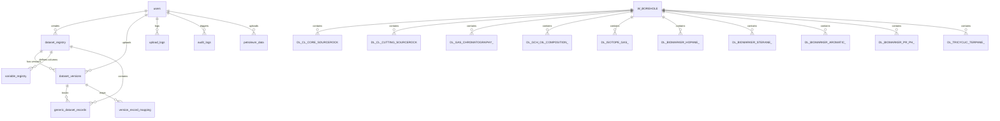

# GVMS — Complete Technical Project & Internship Report Summary

---

## 1. PROJECT TITLE & ONE-LINE DESCRIPTION

* **Formal Project Title**: **GVMS (Graphical Visualization Management System) — Enterprise Petroleum Geochemistry Laboratory Information and Interactive Scientific Analytics Platform**
* **One-Line Description**: An enterprise-grade LIMS and interactive geochemistry analytics system engineered for the **Oil & Natural Gas Corporation (ONGC)** to dynamically ingest, normalize, and visualize high-dimensional subsurface laboratory datasets across Source Rock, Biomarker, Oil, and Gas Isotope disciplines using scientific crossplots, depth profiles, and cryptographically secured BI embedding.

---

## 2. ABSTRACT (150–250 words)

Petroleum exploration and reservoir characterization rely heavily on laboratory geochemistry datasets originating from core samples, drill cuttings, crude oils, and natural gases. Historically, geochemical data across specialized laboratories—such as Rock-Eval Pyrolysis, Gas Chromatography (GC), Gas Chromatography-Mass Spectrometry (GC-MS) Biomarkers, and Stable Carbon Isotope Ratio Mass Spectrometry—remained fragmented across disparate, non-standardized spreadsheets, leading to error-prone manual interpretation and cumbersome cross-plot generation. 

The Graphical Visualization Management System (GVMS) addresses these operational bottlenecks by providing a unified, web-based platform tailored for geochemists. Architected with a FastAPI backend (Python 3.11), SQLAlchemy 2.0 ORM, and a React 18 / TypeScript frontend powered by Plotly.js, GVMS delivers an intelligent data ingestion pipeline that dynamically normalizes heterogeneous Excel/CSV headers via an administrative synonym registry and automatically computes derived geochemical ratios (e.g., Hydrogen Index, Production Index, Pristane/Phytane, Modified Bernard coordinates). The platform renders interactive, publication-ready scientific visualizations, including inverted subsurface depth profiles, kerogen classification diagrams, isotopic genetic maturity plots, and multidimensional biomarker distributions. Enterprise-grade security is enforced through Role-Based Access Control (RBAC), password hashing via bcrypt, audit logging, dual-database support (PostgreSQL 16 and Oracle Enterprise DB), and cryptographically signed JWT embedding for Metabase analytics. The resulting deliverable dramatically accelerates geological interpretation workflows, standardizes cross-basin data correlation, and provides executive technical report generation.

---

## 3. OBJECTIVES

* **Automate Geochemical Ingestion & Standardization**: Build a resilient data ingestion engine capable of parsing multi-format laboratory spreadsheets (CSV, XLSX, XLS), resolving varying column naming conventions via dynamic synonym dictionaries, and eliminating manual data pre-processing.
* **Compute Scientific Formulations in Real-Time**: Implement a centralized mathematical formula engine to derive standard petroleum geochemistry parameters, including Total Organic Carbon (TOC wt%), Pyrolysis yield ($S_1, S_2, S_3$), Hydrogen Index (HI), Oxygen Index (OI), Oil Saturation Index (OSI), Production Index (PI), and carbon isotope ratios ($\delta^{13}\text{C}_1, \delta^{13}\text{C}_2, \delta^{13}\text{C}_3$).
* **Provide Specialized Interactive Visualizations**: Render publication-grade scientific plots adhering to established literature standards (Peters & Cassa, Modified Bernard, Whiticar, Chung, and Sofer diagrams) with client-side zooming, panning, boundary zone overlays, and custom depth profile rendering with inverted Y-axes.
* **Enable Dynamic Cross-Dataset Correlation**: Provide a generic dataset registry and relational cross-plot builder allowing geochemists to execute ad-hoc joins across disparate lab datasets (e.g., joining Rock-Eval Pyrolysis with Gas Chromatography) using shared borehole identifiers (`UBHI`, `BOREHOLE_ID`, depth intervals).
* **Enforce Enterprise Governance & Dual-Database Scalability**: Deliver a secure multi-tier architecture with Role-Based Access Control (`Admin`, `Researcher`, `Viewer`), complete transactional audit logging, automated PDF/Excel reporting, and native compatibility with both PostgreSQL 16 and Oracle Database.

---

## 4. SCOPE

### In-Scope (Implemented in Current Version)
* **Laboratory Modules**: 
  * *Source Rock Laboratory* (Core & Drill Cuttings Pyrolysis, TOC vs. $S_2$ Kerogen Scatter, HI vs. OI Van Krevelen).
  * *Oil Geochemistry Laboratory* (Bulk composition SARA fractions, GC n-alkane distributions $n\text{C}_{10} - n\text{C}_{40}$, $Pr/n\text{C}_{17}$ vs. $Ph/n\text{C}_{18}$ depositional environment crossplots).
  * *Stable Isotope Laboratory* (Gas genetics via Modified Bernard Diagram, Carbon Isotope maturity curves $R_o\%$, Secondary Cracking delta plots, Oil CSIA fractions).
  * *Biomarker Laboratories* (Hopane mass chromatogram $m/z\ 191$ ratios, Sterane $m/z\ 217$ isomer distributions, Tricyclic Terpane distributions, Aromatic Methylphenanthrene maturity indices, and Pristane/Phytane high-resolution grids).
  * *Inorganic (IGC)* and *Surface Geochemistry (MBER)* dashboards.
* **Data & Ingestion Management**: Automated column mapping via database synonym registry, upload version tracking, dataset rollback, and row-level ingestion logs.
* **Dynamic Analytics & Cross-Plot Builder**: User-configured X/Y/Z scatter plots, histograms, depth logs, and dynamic pandas-based relational joins on shared identifiers (`UBHI`, `OBJECT_NUMBER`, `DEPTH`).
* **Reporting & BI**: Server-side styled PDF generation (ReportLab), multi-tab styled Excel workbooks (openpyxl), filtered CSV downloads, and Metabase BI iframe embedding via signed HS256 JWT tokens.
* **Security & Administration**: Token-based authentication (OAuth2 with JWT Access/Refresh tokens), Role-Based Access Control (RBAC), and user management.

### Out-of-Scope (Explicitly Excluded / Flagged as Future Work)
* **Real-time LWD/MWD Sensor Ingestion**: Live streaming from drilling rigs (WITSML / ETP protocols) is not supported; the system focuses on post-drilling laboratory batch data.
* **Direct Integration with Mass Spectrometer Hardware**: Direct RS-232 / TCP device drivers for Rock-Eval / GC-MS machines are excluded; data is ingested via exported files.
* **3D Subsurface Basin Modeling**: Full 3D seismic/structural mesh modeling is out-of-scope; 2D depth profiles, cross-plots, and well correlations are standard.
* **Omission Log / Completeness Reports**: Redundant completeness report tables were intentionally removed to maintain clean scientific dashboard layouts.

---

## 5. METHODOLOGY

The system was developed iteratively following a domain-driven, bottom-up design methodology tailored to petroleum geochemistry workflows:

```
+---------------------+     +---------------------+     +---------------------+     +---------------------+
| 1. Geochemical &    | --> | 2. Backend Engine   | --> | 3. Frontend &       | --> | 4. Containerization |
| Data Model Design   |     | & Business Logic    |     | Plotly Visualization|     | & Production Deploy |
+---------------------+     +---------------------+     +---------------------+     +---------------------+
```

1. **Domain Modeling & Schema Design**: Designed a unified schema capturing both structured laboratory tables (`DL_CL_CORE_SOURCEROCK`, `DL_GAS_CHROMATOGRAPHY_`, `DL_ISOTOPE_GAS_`, `DL_BIOMARKER_HOPANE_`, etc.) and a generic JSONB document store (`generic_dataset_records`, `dataset_registry`, `variable_registry`) to ensure future lab experiments could be added without schema migrations.
2. **Formula & Ingestion Pipeline Implementation**: Developed `formula_engine.py` and `csv_processor.py` to decouple mathematical transformations from storage. Column headers are normalized using fuzzy and exact synonym matching before values undergo mathematical derivation and database ingestion.
3. **Backend REST API Architecture**: Constructed a modular FastAPI service using dependency injection for authentication (`deps.py`), session handling, and RBAC authorization guards.
4. **Interactive Scientific Frontend**: Built a Single Page Application using React 18 and Vite. Implemented custom wrappers around Plotly.js (`CustomPlot.tsx`, `DynamicPlotlyChart.tsx`) to support geological standards (inverted Y-axes for subsurface depths, logarithmic decade scaling, and custom SVG shape boundary zones).
5. **Security, BI Embedding & Orchestration**: Configured reverse proxy routing in Nginx, implemented signed JWT generation for private Metabase embedding, and containerized all microservices via Docker Compose.

---

## 6. SOFTWARE & HARDWARE REQUIREMENTS

### Software Requirements

| Component / Layer | Technology / Tool | Exact Version / Specification | Source |
| :--- | :--- | :--- | :--- |
| **Operating System** | Linux (Ubuntu 20.04/22.04 LTS) / Windows 10/11 | 64-bit Architecture | Base OS |
| **Backend Runtime** | Python | `>= 3.11` | `backend/Dockerfile` |
| **Backend Framework** | FastAPI | `>= 0.110.0` | `backend/requirements.txt` |
| **ASGI Web Server** | Uvicorn (standard) | `>= 0.28.0` | `backend/requirements.txt` |
| **ORM / Query Engine** | SQLAlchemy | `>= 2.0.28` | `backend/requirements.txt` |
| **DB Drivers** | `psycopg2-binary`, `oracledb` | `psycopg2-binary >= 2.9.9`, `oracledb >= 2.0.0` | `backend/requirements.txt` |
| **Data Processing** | Pandas, openpyxl | `pandas >= 2.2.1`, `openpyxl >= 3.1.2` | `backend/requirements.txt` |
| **Report Generation** | ReportLab | `>= 4.1.0` | `backend/requirements.txt` |
| **Security / Crypto** | `python-jose[cryptography]`, `bcrypt`, `passlib` | `python-jose >= 3.3.0`, `bcrypt == 4.0.1`, `passlib >= 1.7.4` | `backend/requirements.txt` |
| **Frontend Runtime** | Node.js / npm | Node `>= 18.x`, npm `>= 9.x` | `frontend/Dockerfile` |
| **Frontend Framework** | React / React-DOM | `^18.2.0` | `frontend/package.json` |
| **Frontend Build Tool** | Vite | `^5.1.6` | `frontend/package.json` |
| **Language** | TypeScript | `^5.4.3` | `frontend/package.json` |
| **Scientific Plotting** | Plotly.js, `react-plotly.js` | `plotly.js-dist-min ^2.30.0`, `react-plotly.js ^2.6.0` | `frontend/package.json` |
| **State & Data Fetching**| TanStack React Query | `^5.28.9` | `frontend/package.json` |
| **CSS & Styling** | TailwindCSS, PostCSS, Autoprefixer | `tailwindcss ^3.4.1`, `postcss ^8.4.38` | `frontend/package.json` |
| **Routing & Forms** | React Router DOM, React Hook Form | `react-router-dom ^6.22.3`, `react-hook-form ^7.51.1` | `frontend/package.json` |
| **Primary Database** | PostgreSQL | `16-alpine` | `docker-compose.yml` |
| **Secondary Database** | Oracle Database (Enterprise / XE) | `19c / 21c / 23ai` | `database/oracle/` |
| **BI Analytics** | Metabase | `metabase/metabase:latest` | `docker-compose.yml` |
| **Reverse Proxy** | Nginx | `nginx:alpine` | `docker-compose.yml` |
| **Containerization** | Docker Engine & Docker Compose | Docker `>= 24.0`, Compose `>= v2.20` | `docker-compose.yml` |

### Minimum Hardware Specifications
* **CPU**: 4 Cores (x86_64) minimum; 8 Cores recommended for concurrent pandas ingestion and ReportLab generation.
* **RAM**: 8 GB RAM minimum; 16 GB RAM recommended for multi-user Plotly data points caching and Docker stack.
* **Storage**: 50 GB SSD storage minimum for PostgreSQL transactional storage, audit logs, and uploaded lab workbooks.

---

## 7. TECHNOLOGIES USED (GROUPED BY LAYER)

### Database & Storage Layer
* **PostgreSQL 16**: Serves as the primary ACID-compliant relational data store holding laboratory datasets, user records, audit trails, and dynamic JSONB configurations.
* **Oracle Database (19c/21c)**: Provides enterprise compatibility for ONGC legacy infrastructure using native sequence generators, `CLOB` JSON constraints, and uppercase SQL dialect mapping.
* **SQLAlchemy 2.0**: Used as the Object Relational Mapper (ORM) and dynamic SQL generator for schema queries, parameter sanitization, and database connection pooling.
* **Alembic**: Manages database migrations and schema versioning.

### Backend Layer
* **FastAPI (Python 3.11)**: Powers the high-throughput asynchronous REST API, providing automatic OpenAPI/Swagger documentation and dependency-injected route security.
* **Pandas**: Performs vector manipulation, dataset normalization, in-memory grouping, multi-table relational joins, and dynamic aggregations.
* **OpenPyXL**: Parses multi-tab Excel workbooks (`.xlsx`/`.xls`) and formats styled multi-sheet export workbooks.
* **ReportLab**: Programmatically compiles executive-level PDF reports with custom ONGC branding, data tables, and dynamic geochemical charts.
* **Python-Jose & Passlib (bcrypt)**: Implements cryptographic signing and verification of JWT access/refresh tokens and password hashing.
* **Pydantic v2**: Enforces strict request/response data validation, type safety, and schema serialization.

### Frontend Layer
* **React 18 & TypeScript**: Delivers a strictly-typed Single Page Application with component-based modularity for lab dashboards.
* **Vite**: Provides lightning-fast HMR (Hot Module Replacement) and optimized production tree-shaking and bundling.
* **Plotly.js (`react-plotly.js`)**: Renders client-side hardware-accelerated scientific charts (depth plots with inverted axes, log-log scatter plots, and multi-polygon overlays).
* **TanStack React Query v5**: Manages asynchronous server state, automatic query caching, re-fetching, and background synchronization.
* **TailwindCSS v3**: Implements an enterprise UI design system featuring ONGC corporate palettes, glassmorphism cards, and responsive flex/grid layouts.
* **Lucide React**: Provides lightweight, uniform SVG iconography across the interface.

### DevOps & Deployment Layer
* **Docker & Docker Compose**: Containerizes the application into isolated microservices (frontend, backend, database, Metabase, reverse proxy) connected via a private bridge network.
* **Nginx**: Operates as a high-performance reverse proxy and SSL terminator routing traffic between frontend (:3001), API (:8001), and Metabase (:3002) while masking internal ports.

---

## 8. SYSTEM ARCHITECTURE

### Multi-Tier Service Architecture

```
                                  +-------------------------------------------------------+
                                  |              Nginx Reverse Proxy (:8080)              |
                                  +---------------------------+---------------------------+
                                                              |
                                  +---------------------------+---------------------------+
                                  | (HTTP / Static Assets)                                | (REST API /api/v1)
                                  v                                                       v
                 +---------------------------------+                     +---------------------------------+
                 |     React 18 SPA (:3001)        |                     |     FastAPI Backend (:8001)     |
                 |---------------------------------|                     |---------------------------------|
                 | - TypeScript & TailwindCSS      |                     | - Pydantic Request Validation   |
                 | - Plotly.js Scientific Charts   |                     | - Geochemistry Formula Engine   |
                 | - TanStack Query Cache          |                     | - Pandas Ingestion Engine       |
                 | - Role-Based Route Guards       |                     | - ReportLab PDF & Excel Builder |
                 +---------------------------------+                     +---------------------------------+
                                  |                                                       |
               (JWT Signed Embed) |                                                       | (SQLAlchemy 2.0 ORM)
                                  v                                                       v
                 +---------------------------------+                     +---------------------------------+
                 |   Private Metabase BI (:3002)   | <------------------ |   PostgreSQL 16 DB (:5433)      |
                 |---------------------------------|      (Read Data)    |   / Oracle DB (1521)            |
                 | - Parameterized BI Questions    |                     |---------------------------------|
                 | - Ad-Hoc Filtering Dashboards   |                     | - Transactional Lab Tables      |
                 +---------------------------------+                     | - Dataset & Variable Registry   |
                                                                         | - RBAC & System Audit Logs      |
                                                                         +---------------------------------+
```

### Key Request & Data Flows

#### 1. Authentication & RBAC Flow
1. The user inputs email and password on the React login screen (`/login`).
2. The frontend dispatches a `POST /api/v1/auth/login` request to FastAPI.
3. FastAPI queries the `users` table via SQLAlchemy, verifies active status, and validates the password hash via `passlib[bcrypt]`.
4. Upon success, FastAPI generates a JWT `access_token` (valid for 8 hours) and a `refresh_token` (valid for 7 days) containing the user's UUID and assigned role (`admin`, `researcher`, `viewer`).
5. The frontend stores tokens in secure local storage, and the React `AuthProvider` initializes user state, enabling `ProtectedRoute` and `LabRouteGuard` checks across all lab navigation paths.

#### 2. Dynamic Data Ingestion & In-Flight Computation Flow
1. A geochemist uploads an Excel/CSV spreadsheet via the dynamic upload interface.
2. The file is streamed via `POST /api/upload` to the FastAPI backend.
3. `csv_processor.py` intercepts the file bytes, loads sheets via `pandas` or `openpyxl`, and executes column header detection against the `dataset_registry` and `variable_registry` synonym arrays.
4. The file rows pass through `formula_engine.py`, which derives missing calculated columns in-flight (e.g., calculating TOC from PC + RC, Hydrogen Index from $S_2/\text{TOC}$, and Pristane/Phytane ratios).
5. Cleaned, type-casted rows are committed to the designated laboratory SQL table or stored as structured JSONB documents within `generic_dataset_records`, creating an immutable `dataset_versions` entry.

#### 3. Scientific Plot Rendering Flow
1. A user selects well names, formation filters, and depth ranges on a lab dashboard (e.g., Gas Isotope Dashboard).
2. React Query executes a `GET /api/v1/dashboard/scientific-plots?dataset_id=X&well_name=...` request.
3. The backend constructs a parameterized SQL query utilizing cached metadata columns, executes the query against PostgreSQL/Oracle, and formats records into numeric coordinate vectors.
4. The React client receives the JSON payload and feeds it into `DynamicPlotlyChart.tsx` or specialized plot functions.
5. Plotly dynamically generates the visualization canvas, applying custom logarithmic scales, scatter markers grouped by well symbol and formation color, and SVG layout shapes for classification boundaries.

#### 4. Cross-Dataset Relational Join Flow
1. In the Cross-Plot Builder, the user selects Dataset 1 (e.g., Source Rock) with Variable X ($S_2$) and Dataset 2 (e.g., Gas Chromatography) with Variable Y ($Pr/Ph$).
2. The client requests `GET /api/v1/dashboard/cross-chart-data`.
3. `dashboard.py` inspects both datasets in `VariableRegistry` and dynamically resolves shared relational keys (`BOREHOLE_ID`, `UBHI`, `OBJECT_NUMBER`, `DEPTH_TOP`).
4. The backend executes queries for both datasets, converts results into two Pandas DataFrames, and executes an in-memory relational `pd.merge()` on the resolved join keys.
5. Joined coordinates are returned to the client and plotted on a unified interactive cross-plot.

---

## 9. DATA MODEL / SCHEMA



### Detailed Table Specifications

#### 1. Core Administration & Security Tables
* `users`: Holds authenticated user credentials, full names, assigned RBAC roles (`admin`, `researcher`, `viewer`), active account flags, and timestamps.
* `audit_logs`: Records all system actions (`LOGIN`, `FILE_UPLOAD`, `REPORT_EXPORT`, `DELETE_USER`), target resource names, user IDs, client IP addresses, and timestamps.
* `upload_logs`: Maintains a historical record of file ingestions, total row counts, successful imports, skipped row counts, and error summaries.

#### 2. Dynamic Registry & Versioning Tables
* `dataset_registry`: Metadata registry storing configurable dataset definitions, target SQL table names, module categories, required column lists, depth/well column identifiers, and JSONB configurations for default charts and filters.
* `variable_registry`: Column-level registry storing physical SQL column names, display titles, data types (numeric vs. string), measurement units, chart/KPI eligibility flags, validation regex rules, and JSON arrays of header synonyms.
* `dataset_versions`: Tracks every file upload cycle per dataset, storing file size, total/imported/skipped row counts, processing status (`pending`, `completed`, `failed`, `rolled_back`), and active version flags.
* `generic_dataset_records`: High-throughput JSONB document store used for datasets without static DDL tables, indexed via PostgreSQL GIN indexes for rapid key-value filtering.
* `version_record_mapping`: Cross-reference table mapping dynamic records in target lab tables to specific upload version IDs to enable instant batch rollbacks.

#### 3. Specialized Laboratory Geochemistry Tables
* `W_BOREHOLE`: Master well/borehole registry holding unique borehole identifiers (`UBHI`, `BOREHOLE_NAME`, `BOREHOLE_ID`).
* `DL_CL_CORE_SOURCEROCK` & `DL_CL_CUTTING_SOURCEROCK`: Rock-Eval pyrolysis measurements on core and cuttings samples (`TOC`, `S1`, `S2`, `S3`, `TMAX`, `HI`, `OI`, `PI`, `OSI`, `VRO`, `LITHOLOGY`, `LAYER_NAME`, `TOP_DEPTH`, `BOTTOM_DEPTH`).
* `DL_GAS_CHROMATOGRAPHY_`: High-resolution gas chromatography n-alkane fractions ($n\text{C}_{10} - n\text{C}_{40}$), Pristane ($Pr$), Phytane ($Ph$), calculated ratios ($Pr/Ph$, $Pr/n\text{C}_{17}$, $Ph/n\text{C}_{18}$), Odd-Even Preference ($OEP$), Carbon Preference Index ($CPI$), and aquatic wax ratios ($P_{\text{aq}}$).
* `DL_GCH_OIL_COMPOSITION_`: Bulk physical and geochemical properties of crude oils (API Gravity, Pour Point, Water Content, Sulfur wt%, and SARA fractions: Saturates, Aromatics, Resins/NSO, Asphaltenes).
* `DL_ISOTOPE_GAS_`: Molecular gas composition ($\text{C}_1, \text{C}_2, \text{C}_3, i\text{C}_4, n\text{C}_4, i\text{C}_5, n\text{C}_5, \text{CO}_2, \text{N}_2, \text{He}, \text{H}_2$) and stable carbon isotope values ($\delta^{13}\text{C}_1, \delta^{13}\text{C}_2, \delta^{13}\text{C}_3, \delta^{13}\text{C}_{i\text{C}4}, \delta^{13}\text{C}_{n\text{C}4}, \delta^{13}\text{CO}_2$), and gas dryness ratios ($C_1/(C_2+C_3)$).
* `DL_BIOMARKER_HOPANE_`: Pentacyclic triterpanes and hopane isomers ($C_{27}\text{Ts}, C_{27}\text{Tm}, C_{29}\text{H}, C_{30}\text{H}, C_{31}-C_{35}$ 22S/22R Homohopanes, Diahopane, Oleanane Index, and $Ts/(Ts+Tm)$).
* `DL_BIOMARKER_STERANE_`: Steroid hydrocarbons ($C_{27}, C_{28}, C_{29}$ Diasteranes and $\alpha\alpha\alpha/\alpha\beta\beta$ Regular Steranes 20S/20R, Total Steranes, and Diasterane indices).
* `DL_BIOMARKER_AROMATIC_`: Aromatic hydrocarbon isomers (Dibenzothiophene, Phenanthrene, 1-, 2-, 3-, 9-Methylphenanthrene, Methylphenanthrene Index `MPI-1`, Calculated Vitrinite Reflectance `%VRe`, and Trimethylnaphthalene ratios).
* `DL_BIOMARKER_PR_PH_`: Dedicated Pristane and Phytane biomarker depth distribution table.
* `DL_TRICYCLIC_TERPANE_`: Cheilanthanes and tricyclic terpanes ($C_{19} - C_{26}$ TR and $C_{24}$ Tetracyclic terpane distributions and relative percentage ratios).

---

## 10. MODULE-WISE BREAKDOWN

### 1. Authentication, Security & RBAC Module
* **Objective**: Protect proprietary geological data and restrict administrative functionality based on enterprise roles.
* **Process**: Validates user credentials against bcrypt hashes, signs JWT access and refresh tokens, and enforces RBAC via FastAPI dependencies (`deps.py`) and React route guards (`LabRouteGuard.tsx`, `ProtectedRoute`).
* **Tools / Libraries**: `python-jose`, `passlib[bcrypt]`, `FastAPI`, `React Router DOM`.
* **Output**: Secure session state, automated token refresh cycles, and role-restricted UI navigation.

### 2. Dynamic Ingestion & Column Mapping Engine
* **Objective**: Ingest heterogeneous laboratory Excel and CSV workbooks without manual schema reconfiguration.
* **Process**: Scans file headers, resolves column names against database-backed synonym arrays, maps data to corresponding database tables, executes in-flight mathematical derivations, and logs import metrics into `dataset_versions`.
* **Tools / Libraries**: `pandas`, `openpyxl`, `SQLAlchemy`, `csv_processor.py`.
* **Output**: Normalized, validated database records and detailed ingestion/error logs.

### 3. Source Rock Geochemistry Dashboard
* **Objective**: Evaluate source rock organic richness, petroleum generation potential, and thermal maturity.
* **Process**: Queries core and cuttings pyrolysis data, classifies Total Organic Carbon (TOC wt%) and Pyrolysis Yield ($S_2$) into standard richness tiers (Poor to Excellent), and renders interactive depth profiles and TOC vs. $S_2$ crossplots with colored boundary zones.
* **Tools / Libraries**: `React 18`, `react-plotly.js`, `geochemistry_engine.py`.
* **Output**: Interactive Kerogen classification plots, depth profiles with inverted Y-axes, and automated sample synthesis texts.

### 4. Oil Geochemistry & Gas Chromatography (GC) Dashboard
* **Objective**: Characterize crude oil physical properties, SARA fractions, and n-alkane fingerprints.
* **Process**: Aggregates gas chromatography carbon distributions ($n\text{C}_{10} - n\text{C}_{40}$), calculates isoprenoid ratios ($Pr/Ph$, $Pr/n\text{C}_{17}$, $Ph/n\text{C}_{18}$), and plots source/redox depositional environment crossplots.
* **Tools / Libraries**: `React 18`, `Plotly.js`, `formula_engine.py`.
* **Output**: $Pr/n\text{C}_{17}$ vs. $Ph/n\text{C}_{18}$ crossplots, SARA fraction pie charts, and hydrocarbon depth profiles.

### 5. Stable Gas Isotope Dashboard
* **Objective**: Determine natural gas genetic origin (biogenic vs. thermogenic) and secondary alteration (cracking/oxidation).
* **Process**: Processes carbon isotope ratios ($\delta^{13}\text{C}_1, \delta^{13}\text{C}_2, \delta^{13}\text{C}_3$) and gas dryness, overlaying sample coordinates on the Modified Bernard Diagram, Isotopic Maturity Reference Curves ($R_o\%$), and Secondary Cracking zones.
* **Tools / Libraries**: `GasIsotopeDashboard.tsx`, `Plotly.js`, `formula_engine.py`.
* **Output**: Modified Bernard classification diagrams, Chung natural gas plots, and delta cracking crossplots.

### 6. Biomarker Dashboards (Hopane, Sterane, Terpane, Aromatic, Pr/Ph)
* **Objective**: Deduce source rock depositional environment, lithology, organic matter input, and thermal maturity from biomarker molecular fossils.
* **Process**: Queries specialized biomarker views (`DL_BIOMARKER_HOPANE_VW`, `DL_BIOMARKER_STERANE_VW`, etc.), computes maturation ratios (e.g., $C_{31}$ 22S/(22S+22R), $C_{29}$ 20S/(20S+20R), MPI-1), and renders multi-well ratio distribution bar charts and crossplots.
* **Tools / Libraries**: `HopaneDashboard.tsx`, `SteraneDashboard.tsx`, `AromaticDashboard.tsx`, `TricyclicDashboard.tsx`, `PrPhDashboard.tsx`.
* **Output**: Molecular biomarker maturation crossplots, homohopane index plots, and sterane ternary distribution charts.

### 7. Dynamic Cross-Plot & Ad-Hoc Analytics Builder
* **Objective**: Enable geochemists to create custom correlations across any registered variables and datasets.
* **Process**: Dynamically joins multi-dataset records via shared identifiers (`UBHI`, `DEPTH_TOP`, `OBJECT_NUMBER`) using in-memory Pandas merge routines and outputs customizable scatter, bar, or histogram plots.
* **Tools / Libraries**: `DynamicDashboard.tsx`, `dashboard.py`, `pandas`.
* **Output**: User-defined bivariate and trivariate geochemical correlation diagrams.

### 8. Metabase Business Intelligence (BI) Integration
* **Objective**: Embed private, pre-filtered analytical dashboards within the application interface.
* **Process**: Backend retrieves the secret embed key, signs a JWT token specifying the dashboard ID and dataset parameters, and the frontend embeds the target via a sandboxed iframe through Nginx.
* **Tools / Libraries**: `metabase_service.py`, `jose.jwt`, `MetabaseView.tsx`.
* **Output**: Seamless, interactive Metabase BI dashboard embeds without requiring external user login.

### 9. Technical Report & Data Export Engine
* **Objective**: Generate publication-ready PDF reports and structured data workbooks.
* **Process**: Collects active dashboard filters, fetches tabular data, and uses ReportLab to render formal ONGC-branded PDF summaries with embedded charts, or openpyxl to compile multi-sheet Excel workbooks.
* **Tools / Libraries**: `report_generator.py`, `ReportLab`, `openpyxl`.
* **Output**: Downloadable executive PDF summaries, filtered Excel sheets, and CSV extracts.

---

## 11. KEY SOURCE CODE TO HIGHLIGHT

| # | File Path | Core Function / Class | Line Range | Purpose Statement |
| :--- | :--- | :--- | :--- | :--- |
| 1 | `backend/app/main.py` | `lifespan(app: FastAPI)` | L11–L34 | Application lifespan hook managing database initialization, schema verification, and default account seeding on startup. |
| 2 | `backend/app/core/security.py` | `create_access_token()`, `verify_password()` | L15–L48 | Cryptographic JWT token generation and bcrypt password hash verification routines. |
| 3 | `backend/app/api/deps.py` | `get_current_user()`, `require_roles()` | L25–L85 | Dependency-injected OAuth2 authentication and role-based access control authorization barriers. |
| 4 | `backend/app/services/formula_engine.py` | `calculate_derived_parameters()`, `calculate_chromatography_ratios()` | L13–L102 | Central mathematical engine computing derived geochemical parameters (HI, OI, PI, OSI, TOC, and GC ratios). |
| 5 | `backend/app/services/geochemistry_engine.py` | `build_s2_toc_chart_figure()` | L244–L389 | Constructs the Plotly S2 vs. TOC Kerogen classification figure with logarithmic axes and standard literature annotation boundaries. |
| 6 | `backend/app/services/csv_processor.py` | `CSVProcessor.process_file()` | L120–L250 | Ingestion engine parsing Excel/CSV files, resolving column synonyms against the DB registry, and handling database commits. |
| 7 | `backend/app/api/v1/endpoints/dashboard.py` | `get_scientific_plots()` | L697–L847 | Core API endpoint executing dynamic parameterized queries across laboratory tables to deliver coordinate vectors for charts. |
| 8 | `backend/app/api/v1/endpoints/dashboard.py` | `get_cross_chart_data()` | L1038–L1180 | Resolves shared relational join keys (UBHI, depth) and executes in-memory pandas merges across disparate lab datasets. |
| 9 | `backend/app/api/v1/endpoints/dashboard.py` | `get_metabase_embed_url()` | L849–L906 | Generates signed, time-limited HS256 JWT tokens to securely embed private Metabase analytical dashboards. |
| 10 | `backend/app/services/report_generator.py` | `generate_pdf_report()` | L80–L210 | Generates formal, publication-styled PDF summary reports with ONGC headers, KPI tables, and charts using ReportLab. |
| 11 | `frontend/src/pages/GasIsotopeDashboard.tsx` | `GasIsotopeDashboard` component | L274–L420 | Interactive React component rendering the Modified Bernard, Isotopic Maturity, and Secondary Cracking diagrams. |
| 12 | `frontend/src/components/charts/CustomPlot.tsx` | `CustomPlot` component | L1–L65 | Plotly.js wrapper standardizing responsive layouts, toolbar buttons, and inverted depth axis behavior. |

---

## 12. API ENDPOINTS

### Authentication & User Management
| Method | Endpoint | Purpose |
| :--- | :--- | :--- |
| `POST` | `/api/v1/auth/login` | Authenticates credentials and returns JWT Access and Refresh tokens. |
| `POST` | `/api/v1/auth/refresh` | Generates a fresh JWT Access token using a valid Refresh token. |
| `GET` | `/api/v1/auth/me` | Retrieves the profile and role details of the currently authenticated user. |
| `PUT` | `/api/v1/auth/me/password` | Allows the logged-in user to update their account password. |
| `POST` | `/api/v1/auth/forgot-password`| Initiates a password reset request. |
| `GET` | `/api/v1/users` | Lists all registered users (Admin-only). |
| `POST` | `/api/v1/users` | Creates a new user account with an assigned role (Admin-only). |
| `GET` | `/api/v1/users/{user_id}` | Fetches user details by UUID (Admin-only). |
| `PUT` | `/api/v1/users/{user_id}` | Modifies user details, role, or active status (Admin-only). |
| `DELETE`| `/api/v1/users/{user_id}` | Deactivates or removes a user account (Admin-only). |

### Analytics & Dashboard
| Method | Endpoint | Purpose |
| :--- | :--- | :--- |
| `GET` | `/api/v1/dashboard` | Retrieves high-level dataset metrics, total well counts, and sample KPIs. |
| `GET` | `/api/v1/dashboard/chart-data` | Returns aggregated data points for dynamic chart builder widgets. |
| `GET` | `/api/v1/dashboard/scientific-plots`| Fetches filtered numeric coordinates for scientific depth profiles and crossplots. |
| `GET` | `/api/v1/dashboard/cross-chart-data`| Executes multi-dataset relational joins to deliver cross-dataset plot coordinates. |
| `GET` | `/api/v1/dashboard/embed-url` | Generates a signed JWT iframe URL for private Metabase BI dashboard embeds. |
| `GET` | `/api/v1/dashboard/graph-data/{id}`| Retrieves pre-configured graph data points for a specific registered graph. |

### Dynamic Datasets & Ingestion
| Method | Endpoint | Purpose |
| :--- | :--- | :--- |
| `GET` | `/api/datasets` | Lists all registered laboratory dataset configurations. |
| `GET` | `/api/datasets/{id}` | Retrieves detailed metadata and configuration for a specific dataset. |
| `GET` | `/api/variables` | Returns all registered geochemical variables, data types, units, and synonyms. |
| `POST` | `/api/upload` | Ingests CSV or Excel workbooks, resolves synonyms, and commits records. |
| `GET` | `/api/metadata` | Fetches available filter options, distinct wells, and numeric min/max ranges. |
| `GET` | `/api/datasets/{id}/records` | Returns paginated raw tabular records for a dataset. |

### Reports, Health & System Management
| Method | Endpoint | Purpose |
| :--- | :--- | :--- |
| `GET` | `/api/v1/reports` | Exports filtered dataset records as executive PDF, styled Excel, or CSV. |
| `GET` | `/api/v1/health` | Verifies backend connectivity, database health, and service uptime. |
| `GET` | `/api/v1/audit-logs` | Retrieves paginated system audit trails (Admin-only). |
| `GET` | `/api/v1/monitoring` | Returns system resource utilization and database query latency metrics. |
| `POST` | `/api/v1/backup` | Triggers an automated database backup dump (Admin-only). |
| `POST` | `/api/v1/restore` | Restores database state from a designated backup archive (Admin-only). |

---

## 13. HOW TO RUN / DEPLOY

### Option A: Complete Docker Compose Deployment (Recommended)

1. **Clone the repository and enter the directory**:
   ```bash
   git clone https://github.com/ongc/gvms.git
   cd gvms
   ```

2. **Configure Environment Variables**:
   ```bash
   cp .env.example .env
   # Edit .env to supply secure passwords and secrets:
   # POSTGRES_PASSWORD, SECRET_KEY, METABASE_EMBED_SECRET_KEY, etc.
   ```

3. **Launch the Container Stack**:
   ```bash
   docker compose up --build -d
   ```

4. **Verify Container Health**:
   ```bash
   docker compose ps
   ```

5. **Seed Default Geochemistry Datasets & Accounts**:
   ```bash
   docker compose exec backend python /app/scripts/seed_data.py
   ```

6. **Access the Application**:
   * **Web Portal (Nginx Reverse Proxy)**: `http://localhost:8080` (or `http://SERVER_IP:8080`)
   * **FastAPI OpenAPI Interactive Docs**: `http://localhost:8001/docs`
   * **Private Metabase BI**: Accessible internally via dashboard embed.

---

### Option B: Local Developer Setup (Bare Metal / Virtualenv)

#### 1. Backend Setup
```bash
cd backend
python -m venv venv
# Windows:
.\venv\Scripts\activate
# Linux/macOS:
source venv/bin/activate

pip install -r requirements.txt
uvicorn app.main:app --host 0.0.0.0 --port 8001 --reload
```

#### 2. Frontend Setup
```bash
cd frontend
npm install
npm run dev -- --port 3001 --host
```

#### 3. Default Credentials
* **Administrator**: `admin@ongc.co.in` / `Admin@123456`
* **Researcher**: `researcher@ongc.co.in` / `Researcher@123`
* **Viewer**: `viewer@ongc.co.in` / `Viewer@123`

---

## 14. NOTABLE OUTPUTS / FEATURES TO SCREENSHOT

1. **Enterprise Authentication Screen (`/login`)**: Sleek login card with ONGC corporate branding, email validation, and role badge indicators.
2. **Source Rock Pyrolysis Dashboard (`/`)**: 
   * Top-level KPI cards (Total Wells, Sample Count, Average TOC wt%, Average $S_2$).
   * Interactive **TOC vs. $S_2$ Kerogen Scatter Plot** with color-coded classification zones (Poor, Fair, Good, Very Good, Excellent).
   * Dual subsurface **Depth Profiles** (TOC and $S_2$ vs. Depth with inverted vertical Y-axis).
3. **Gas Isotope Genetics Dashboard (`/isotope/dashboard`)**:
   * **Modified Bernard Diagram** ($\delta^{13}\text{C}_1$ vs. $C_1/(C_2+C_3)$) displaying microbial, thermogenic, and mixed gas genetic origin fields.
   * **Isotopic Maturity Plot** ($\delta^{13}\text{C}_2$ vs. $\delta^{13}\text{C}_1, \delta^{13}\text{C}_3$) featuring theoretical Vitrinite Reflectance ($R_o\%$) maturity curves.
   * **Secondary Cracking Diagram** ($C_2/C_3$ vs. $\delta^{13}\text{C}_2 - \delta^{13}\text{C}_3$) with diagonal zone shading.
4. **Oil Gas Chromatography Dashboard (`/oil/dashboard`)**:
   * **Pristane/$n\text{C}_{17}$ vs. Phytane/$n\text{C}_{18}$ Crossplot** classifying marine vs. terrestrial depositional redox environments.
   * $n$-Alkane carbon distribution histograms ($n\text{C}_{10} - n\text{C}_{40}$).
5. **Biomarker Laboratories (`/biomarker/*`)**:
   * **Hopane Dashboard**: $m/z\ 191$ ratio distributions ($C_{29}\text{H}/C_{30}\text{H}$, $Ts/Tm$, and Homohopane Index).
   * **Sterane Dashboard**: $m/z\ 217$ ternary configurations ($C_{27}, C_{28}, C_{29}$ Diasteranes vs. Regular Steranes).
   * **Aromatic Dashboard**: Source rock maturity crossplots ($MPI\text{-}1$ vs. Calculated $\%VRe$).
6. **Dynamic Cross-Plot Builder (`/dynamic-dashboard`)**: Multi-variable selection panel allowing ad-hoc bivariate correlation across disparate lab datasets.
7. **Metabase Analytics View (`/metabase`)**: Seamless iframe embedding of private Metabase dashboards authenticated via signed HS256 JWT tokens.
8. **Administrative Panel & Audit Logs (`/users`, `/logs`)**: User account management grid and real-time security audit log tables.
9. **Technical PDF Report**: Formally styled PDF export containing corporate headers, active filter summaries, KPI tables, and high-resolution chart snapshots.

---

## 15. CONCLUSION POINTS

* **Successful Domain-Specific Engineering**: Designed and delivered an enterprise-grade LIMS and interactive visualization platform specifically addressing the complex data challenges of petroleum geochemistry at ONGC.
* **Elimination of Data Fragmentation**: Automated the ingestion of heterogeneous laboratory spreadsheets via a dynamic synonym registry and real-time mathematical formula engine, reducing data pre-processing overhead.
* **Advanced Scientific Visualization**: Implemented publication-quality interactive charts (Modified Bernard, Peters & Cassa Kerogen, $Pr/n\text{C}_{17}$ vs. $Ph/n\text{C}_{18}$, and biomarker distributions) with client-side interactivity and geological depth profile conventions.
* **Enterprise Security & Dual-Database Flexibility**: Delivered a microservices architecture supporting Role-Based Access Control (RBAC), audit logging, signed JWT BI embedding, and dual compatibility with PostgreSQL 16 and Oracle Database.
* **Demonstrated Technical Competencies**: Exhibited mastery across full-stack engineering, including asynchronous Python API development (FastAPI), modern frontend state and visualization architecture (React 18, TypeScript, TanStack Query, Plotly.js), containerized orchestration (Docker Compose, Nginx), and relational database modeling.

---

## 16. FUTURE WORK

* **Machine Learning-Driven Lithology Prediction**: Implement supervised classification models (e.g., Random Forest or XGBoost) to automatically predict source rock lithofacies and kerogen type directly from raw pyrolysis and GC fingerprints.
* **Automated Well Log Correlation & Stratigraphic Tying**: Integrate well-to-well correlation tracks allowing geochemists to align geochemical markers with petrophysical wireline logs (Gamma Ray, Resistivity, Sonic).
* **Direct LIMS Equipment Driver Integrations**: Develop IoT/Edge connector services supporting standardized protocols (e.g., OPC-UA or WITSML) to ingest data streams directly from Rock-Eval and GC-MS laboratory instruments.
* **Spatial GIS Mapping**: Integrate Leaflet / Mapbox GIS layers to plot wellheads, sample locations, and regional geochemical maturity contours on geographical maps.
* **Automated Geochemical Anomaly Detection**: Incorporate unsupervised anomaly detection algorithms (e.g., Isolation Forests) to flag potential laboratory measurement errors or hydrocarbon contamination before database ingestion.

---

## 17. BIBLIOGRAPHY / REFERENCES

1. **FastAPI Framework**: [https://fastapi.tiangolo.com/](https://fastapi.tiangolo.com/)
2. **React Official Documentation**: [https://react.dev/](https://react.dev/)
3. **Plotly JavaScript Open Source Graphing Library**: [https://plotly.com/javascript/](https://plotly.com/javascript/)
4. **TanStack Query (React Query v5)**: [https://tanstack.com/query/v5/docs/react/overview](https://tanstack.com/query/v5/docs/react/overview)
5. **SQLAlchemy 2.0 Documentation**: [https://docs.sqlalchemy.org/en/20/](https://docs.sqlalchemy.org/en/20/)
6. **PostgreSQL 16 Relational Database**: [https://www.postgresql.org/docs/16/index.html](https://www.postgresql.org/docs/16/index.html)
7. **Python python-oracledb (Oracle DB Driver)**: [https://python-oracledb.readthedocs.io/](https://python-oracledb.readthedocs.io/)
8. **Pandas Data Analysis Library**: [https://pandas.pydata.org/docs/](https://pandas.pydata.org/docs/)
9. **ReportLab PDF Generation Library**: [https://docs.reportlab.com/](https://docs.reportlab.com/)
10. **Metabase Embedding Documentation**: [https://www.metabase.com/docs/latest/embedding/introduction](https://www.metabase.com/docs/latest/embedding/introduction)
11. **Peters, K. E., & Cassa, M. R. (1994)**. *Applied Source Rock Geochemistry*. In: The Petroleum System—From Source to Trap (AAPG Memoir 60), pp. 93–120. [https://store.aapg.org/detail.aspx?id=433](https://store.aapg.org/detail.aspx?id=433)
12. **Bernard, B. B., Brooks, J. M., & Sackett, W. M. (1976)**. *Natural gas occurrence in the Gulf of Mexico*. Earth and Planetary Science Letters, 31(1), 48-54. [https://doi.org/10.1016/0012-821X(76)90095-9](https://doi.org/10.1016/0012-821X(76)90095-9)
13. **Whiticar, M. J. (1999)**. *Carbon and hydrogen isotope systematics of bacterial formation and oxidation of methane*. Chemical Geology, 161(1-3), 291-314. [https://doi.org/10.1016/S0009-2541(99)00092-3](https://doi.org/10.1016/S0009-2541(99)00092-3)
14. **TailwindCSS Documentation**: [https://tailwindcss.com/docs](https://tailwindcss.com/docs)
